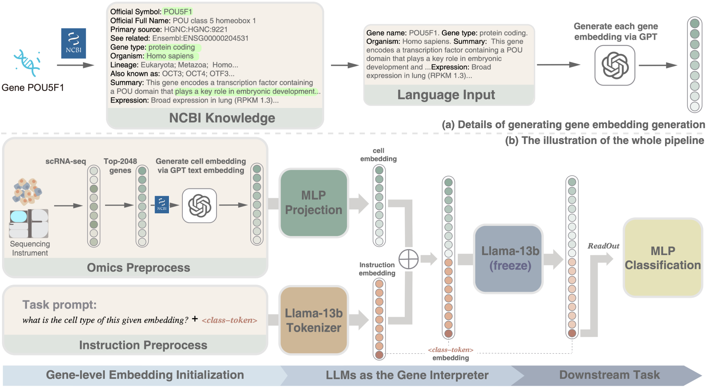

# Prompting Large Language Models to Interpret scRNA-seq Data
Large language models (LLMs) have demonstrated remarkable advancements, primarily due to their capabilities in modeling the hidden relationships within text sequences. 
This innovation presents a unique opportunity in the field of life sciences, where vast collections of single-cell omics data from multiple species provide a foundation for training foundational models. 
However, the challenge lies in the disparity of data scales across different species, hindering the development of a comprehensive model for interpreting genetic data across diverse organisms.
In this study, we propose an innovative hybrid approach that integrates the general knowledge capabilities of LLMs with domain-specific representation models for single-cell omics data interpretation. 
We begin by focusing on genes as the fundamental unit of representation. Gene representations are initialized using functional descriptions, leveraging the strengths of mature language models such as LLaMA-2. 
By inputting single-cell gene-level expression data with prompts, we effectively model cellular representations based on the differential expression levels of genes across various species and cell types.
In the experiments, we constructed developmental cells from humans and mice, specifically targeting cells that are challenging to annotate. We evaluated our methodology through basic tasks such as cell annotation and visualization analysis. The results demonstrate the efficacy of our approach compared to other methods using LLMs, highlighting significant improvements in accuracy and interoperability. 
Our hybrid approach enhances the representation of single-cell data and offers a robust framework for future research in cross-species genetic analysis.

<div align=center></div>


- This is the official repository of Prompting Large Language Models to Interpret scRNA-seq Data, which provides training and testing code.

## Building Environment
- Our code is implemented based on Pytorch. We use pytorch-2.2.1 and cuda-12.0. Another version could also be compatible. Building the environment and installing the needed package. 
- Run the following in shell:
```
conda install python=3.11
pip install -r requirements.txt
```

## Download pretrained LLMs
Here we provide an example of the download link for the HuggingFace LLaMA2 model; other models from HuggingFace(https://huggingface.co/models) are also compatible.

| Model | Description | Download | 
|:------|:-------|:-------:|
| Llama2-7b | 7b parameters. |[Link](https://huggingface.co/meta-llama/Llama-2-7b-hf) | 
| Llama2-13b | 13b parameters.| [Link](https://huggingface.co/meta-llama/Llama-2-13b-hf) | 

Downloaded models should be put in the following directory
```
/path/to/scInterpreter/llm/
```


## Prepare Data
### Preprocess data 
We here show the data processing procedures with [preprocess](./preprocess).

### Pretrain data


## Testing the pipeline
### Request NCBI gene discriptions
See requesting [script](ncbi/request_ncbi_text_for_genes.py)  on human and mouse gene set.
One can request gene discription by run the following command:
```
cd ncbi/
python request_ncbi_text_for_genes.py \
    --species_choice "human" \
    --output_file ./discription/human_ncbi.json \
    --cache_dir ./
```
If the requesting is interrupted due to network fluctuations, simply rerun the script with the same parameters to continue from where it left off.

### Request complementational gene discriptions from GPT
See requesting [script](ncbi/request_complementational_gene_discription.py)  on human and mouse gene set.
by run the following command:
```
cd ncbi/
python request_complementational_gene_discription.py \
    --species_choice "human" \
    --api_key "your api key" \
    --output_file ./discription/human_ncbi_complementation.json \
    --cahce_dir ./
```

### Request gene embeddings from GPT
By [example](ncbi/request_embeddings_for_genes.py)
```
cd ncbi/
python request_complementational_gene_discription.py \
    --api_key "your api key" \
    --discription_file ./discription/human_ncbi_complementation.json \
    --output_file  ./embeddings/human_embeddings.pkl \
```

### Cell-type classification task
[example](celltype_classification.ipynb)


## Citation
If you find this code useful for your research, please consider citing:
```
@article{
}
```# Prompting-Large-Language-Models-to-Interpret-scRNA-seq-Data
